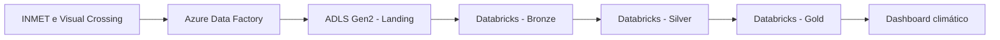

# Climate Lakehouse Azure

Plataforma de dados climáticos construída na Azure para ingerir, processar e disponibilizar dados meteorológicos do INMET e da Visual Crossing.

O projeto integra Azure Data Factory e Azure Databricks em um fluxo de ponta a ponta, da ingestão à camada analítica, utilizando arquitetura medalhão.

## Arquitetura



## Tecnologias

- Azure Data Factory
- Azure Data Lake Storage Gen2
- Azure Databricks
- Apache Spark e PySpark
- Delta Lake
- Azure Key Vault
- Databricks Workflows
- Databricks SQL Dashboard
- JSON, Python e YAML

## Fluxo de dados

1. O Azure Data Factory coleta dados do INMET e da Visual Crossing.
2. Os dados brutos são armazenados na área de landing do ADLS Gen2.
3. A camada Bronze preserva e registra os dados ingeridos.
4. A camada Silver limpa, padroniza e integra as diferentes fontes.
5. A camada Gold produz indicadores e análises climáticas.
6. O dashboard apresenta métricas de monitoramento climático do Brasil.

## Estrutura

```text
.
├── adf/
│   ├── datasets/
│   ├── linked-services/
│   ├── pipelines/
│   ├── triggers/
│   └── docs/
├── databricks/
│   ├── bronze/
│   ├── silver/
│   ├── gold/
│   ├── dashboard/
│   ├── workflows/
│   └── docs/
└── README.md
```

## Componentes

### Azure Data Factory

Os artefatos em `adf/` definem datasets, linked services, pipelines de ingestão histórica e diária e o trigger de execução. Credenciais devem ser obtidas pelo Azure Key Vault; nenhum segredo deve ser versionado.

### Azure Databricks

Os artefatos em `databricks/` implementam as camadas Bronze, Silver e Gold, a integração das fontes climáticas, o workflow de execução e o dashboard analítico.

## Fontes

- INMET: estações e microdados meteorológicos
- Visual Crossing: dados climáticos históricos e atualizados

## Segurança

- Use Managed Identity sempre que possível.
- Armazene credenciais no Azure Key Vault e em secret scopes.
- Não versione tokens, chaves, connection strings ou dados sensíveis.
- Aplique o princípio do menor privilégio às identidades dos serviços.

## Status

O projeto contém os artefatos de ingestão do ADF, notebooks e código das camadas medalhão, workflow Databricks e dashboard climático. A configuração deve ser parametrizada para o ambiente Azure utilizado.


## Documentação

A documentação técnica e operacional está disponível em [docs/README.md](docs/README.md), incluindo arquitetura, fluxo de dados, catálogo, implantação, operação, segurança e troubleshooting.

## Autor

Lucas Alexandre — [GitHub](https://github.com/Lal3x)
