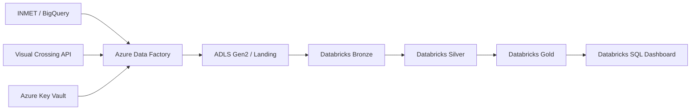

# Arquitetura

## Visão geral

## Componentes

| Componente | Responsabilidade |
| --- | --- |
| Azure Data Factory | Orquestrar a extração das fontes e gravar arquivos na landing |
| Azure Key Vault | Manter a chave da Visual Crossing fora dos datasets e pipelines |
| ADLS Gen2 | Persistir arquivos de landing e fornecer o armazenamento do lakehouse |
| Azure Databricks | Executar ingestão incremental, padronização, integração e agregações |
| Delta Lake | Fornecer tabelas transacionais nas camadas Bronze, Silver e Gold |
| Unity Catalog | Organizar os objetos no catálogo `climate` |
| Databricks Workflows | Coordenar dependências entre as tarefas medalhão |
| Databricks SQL | Consultar a Gold e alimentar o dashboard climático |

## Princípios adotados

- Arquitetura medalhão para separar ingestão, padronização e consumo.
- Preservação de metadados de ingestão para rastreabilidade.
- Processamento orientado pela data `ingestion_date`.
- Particionamento por data de ingestão nas tabelas processadas.
- Uso de Managed Identity e Key Vault para autenticação entre serviços.
- Priorização do INMET quando ambas as fontes cobrem a mesma cidade e data.
- Artefatos de infraestrutura e pipeline mantidos no Git.

## Limites atuais

O repositório contém artefatos exportados dos serviços, mas não possui infraestrutura como código completa. A criação dos recursos Azure ainda depende de configuração no Portal/CLI. O workflow Databricks também mantém referências aos caminhos antigos do repositório e deve ser atualizado antes de um novo deploy.
