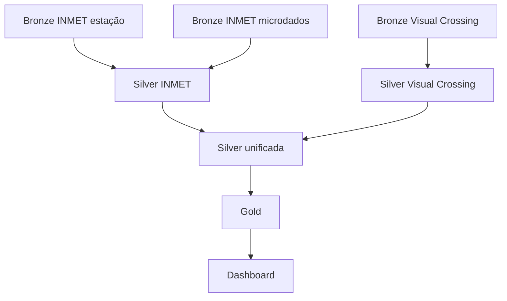

# Azure Databricks

## Estrutura

```text
databricks/
├── bronze/
├── silver/
├── gold/
├── dashboard/
├── workflows/
└── docs/
```

## Bronze

O notebook `ingest_raw.ipynb` é reutilizado pelas três tarefas de ingestão. Seus parâmetros principais são:

| Parâmetro | Uso |
| --- | --- |
| `source_system` | Identificar a origem |
| `source_path` | Diretório de entrada |
| `file_format` | CSV ou JSON |
| `target_table` | Tabela Delta de destino |
| `ingestion_date` | Recorte lógico do processamento |
| `schema_location` | Persistência do schema inferido |
| `checkpoint_location` | Estado da ingestão incremental |

## Silver

### INMET

Combina cadastro de estações e microdados, converte tipos, padroniza campos meteorológicos e grava `climate.silver.climate_inmet`.

### Visual Crossing

Expande a estrutura JSON, padroniza unidades e colunas e grava `climate.silver.climate_visual_crossing`.

### Unificação

Executa `unionByName`, normaliza cidades e grava `climate.silver.climate_unified`, particionada por `data_ingestao`. A escrita usa `replaceWhere`, permitindo reprocessar uma data sem sobrescrever as demais.

## Gold

O script `gold_analises_climaticas.py` cria tabelas analíticas no catálogo `climate.gold`. Quando INMET e Visual Crossing possuem dados para a mesma cidade e dia, o INMET recebe prioridade.

A tendência interanual exige pelo menos cinco anos por cidade e mês. A normal climatológica só deve ser interpretada com histórico suficiente.

## Workflow

A dependência lógica é:



O parâmetro global `ingestion_date` usa, por padrão, a data de início do job.

## Configuração antes do deploy

O workflow foi atualizado para a estrutura atual do repositório, para a Git source `Lal3x/climate-lakehouse-azure.git` e para caminhos de volume com `landing`.

Antes de aplicar o YAML, substitua os placeholders `<subscriber-email>`, `<warehouse-id>` e `<dashboard-id>` pelos valores do ambiente de destino.